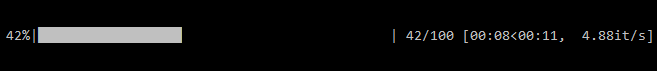

Tutorial 2: Display Latency
===========================

Measurements of display latency using VRLatency is not limited to Virtual Reality systems,
and you can measure the latency of pretty much any display, as long as you can have the display
to shine some light on the device. Let's go through this process in this tutorial.

The flow of measuring the latency of our projector is as follow:
    - Connect to Arduino
    - Define a stimulus
    - Define the experiment
    - Run the experiment
    - Save the data

In case you want to visualize the data:
    - Read the (saved) data
    - Compute the latencies
    - Visualize

Connect to Arduino
++++++++++++++++++

.. note:: Make sure you have already installed arduino drivers on your system. you can check this by going to Device Manager on your system and check whether your system has recognized the connected Arduino(s).

To connect to the Arduino we need to know which USB PORT is the device connected to. Although
one can check that in Device Manager, VRLatency provides a quick way of getting a list of all the
Arduinos that are connected to your system.
::

    import vrlatency as vrl

    vrl.Arduino.find_all()

Once you have the list of Arduino devices connected to your PC (including the USB PORT number), you can
connect the the device as follow:
::

    myarduino = vrl.Arduino.from_experiment_type(experiment_type='Display',
                                                 port='COM9',
                                                 baudrate=250000)

Once the above code is ran, we have a Serial Channel object with which data can be streamed between Arduino
and Python. Besides the USB PORT, we also need to define the communication BAUDRATE as well as the type of
experiments we are planning to run - in this case "Display".

.. note:: BAUDRATE usually takes values such as 300, 600, ..., 9600, 14400, ..., 115200. However, any BAUDRATE chosen in your Python script must agree with the BAUDRATE settings in the Arduino code.

Create a stimulus
+++++++++++++++++

Since we are are measuring the latency of our display, we need to display something that could be measured
by our device. VRLatency provides a very simple module that let's the user to create a simple square stimulus as follow:

::

    mystim = vrl.Stimulus(position=(800, 400), size=700)

Define (and run) the experiment
+++++++++++++++++++++++++++++++

Now that we have established a communication channel as well as a stimulus, we can define (and run) our experiment. we can create
an experiment object depending on the type of experiment we want to run. In this case, we want to measure
display latencies, so we create a DisplayExperiment.

::

    # Define the experiment
    myexp = vrl.DisplayExperiment(arduino=myarduino,
                                  trials=100,
                                  fullscreen=True, screen_ind=1,
                                  stim=mystim,
                                  on_width=.05,
                                  off_width=[.05, .2])

    # Run the experiment
    myexp.run()

While the experiment is running, you keeps you informed about the progress of the experiment.

Save the data
+++++++++++++

Once the experiment is over, you can save the data, simply by executing the following code snippet:

::

    path = "C:/Users/UserName/Desktop/tutorial1_display_experiment.csv"
    myexp.save(path)

Loading data and visualization
++++++++++++++++++++++++++++++

To load the data, you can use the :py:meth:`.read_csv` method provided by :py:class:`vrlatency.analysis` module, which
return a pandas dataframe:

::

    from vrlatency.analysis import read_csv
    path = "C:/Users/UserName/Desktop/tutorial1_display_experiment.csv"
    df = read_csv(path)

Once you loaded the data, you can use the :py:meth:`.get_latencies` method from :py:class:`vrlatency.analysis` module,
which returns the latency values per trial of the experiment.

::

    from vrlatency.analysis import get_display_latencies
    latencies = get_display_latencies(df)

And finally we can use any visualization package to visualize our latency values in any way we would prefer.
Here, I am going to use seaborn and matplotlib to plot a histogram of the latency values:

::

    import matplotlib.pyplot as plt
    import seaborn as sns

    sns.distplot(latencies.iloc[1:] / 1000.)
    plt.show()

Code summary
++++++++++++

Here is the summary of the code snippets discussed above:

::

    import vrlatency as vrl
    from vrlatency.analysis import read_csv, get_display_latencies
    import matplotlib.pyplot as plt
    import seaborn as sns

    # Connect to device
    myarduino = vrl.Arduino.from_experiment_type(experiment_type='Display', port='COM9', baudrate=250000)

    # Create a stimulus
    mystim = vrl.Stimulus(position=(800, 400), size=700)

    # Create an experiment
    myexp = vrl.DisplayExperiment(arduino=myarduino,
                                  trials=100,
                                  fullscreen=True, screen_ind=1,
                                  stim=mystim,
                                  on_width=.05,
                                  off_width=[.05, .2])

    myexp.run()

    path = "C:/Users/UserName/Desktop/tutorial1_display_experiment.csv"
    myexp.save(path)

    df = read_csv(path)

    latencies = get_display_latencies(df)

    sns.distplot(latencies.iloc[1:] / 1000.)
    plt.show()

